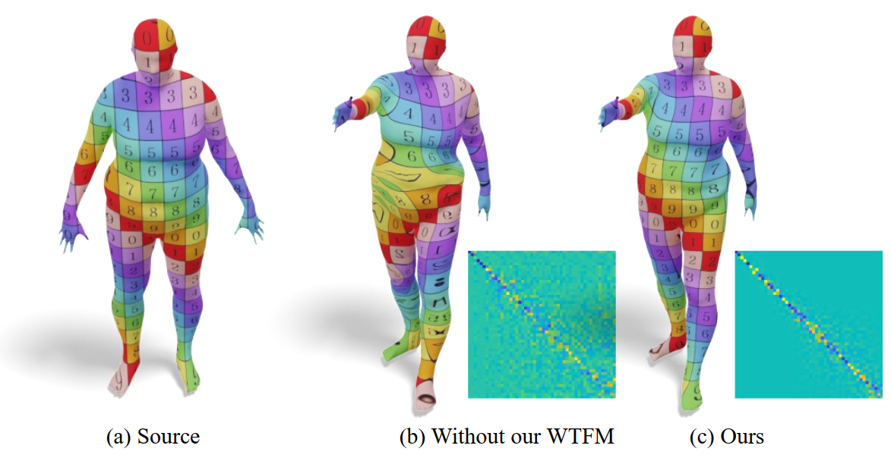

# WTFM-Layer

Code for "WTFM Layer: An Effective Map Extractor for Unsupervised Shape Correspondence", published at PG 2022. 

You can view the detailed content of the paper [here](https://onlinelibrary.wiley.com/doi/abs/10.1111/cgf.14656).
<p align="center">

</p>

# Installation
```
python  >= 3.8
pytorch >= 1.11.0
```

# Download data
Regarding the [remesh 5K dataset](https://nuage.lix.polytechnique.fr/index.php/s/LJFXrsTG22wYCXx), we used the dataset from GeomFmaps, and for the [anisotropic dataset](https://github.com/nicolasdonati/DUO-FM/tree/main/data), we used the dataset from DUO-FMNet. Please put the downloaded data in the off format into the directory `data/datasetname/shapes`.

# Usage
To train WTFM model, use the training script:
```
> python train.py  
```
We provide networks trained on the Faust Remesh and SCAPE Remesh datasets, and the network parameters are saved in `saved_models/faust/ckpt_ep0.pth` and `saved_models/scape/ckpt_ep0.pth`. You can directly run the following code to verify the experimental accuracy mentioned in the paper:
```
> python train.py --evaluate
```

# Citation
```
@inproceedings{liu2022wtfm,
  title={WTFM Layer: An Effective Map Extractor for Unsupervised Shape Correspondence},
  author={Liu, Shengjun and Xu, Haojun and Yan, Dong-Ming and Hu, Ling and Liu, Xinru and Li, Qinsong},
  booktitle={Computer Graphics Forum},
  volume={41},
  number={7},
  pages={51--61},
  year={2022},
  organization={Wiley Online Library}
}
```
